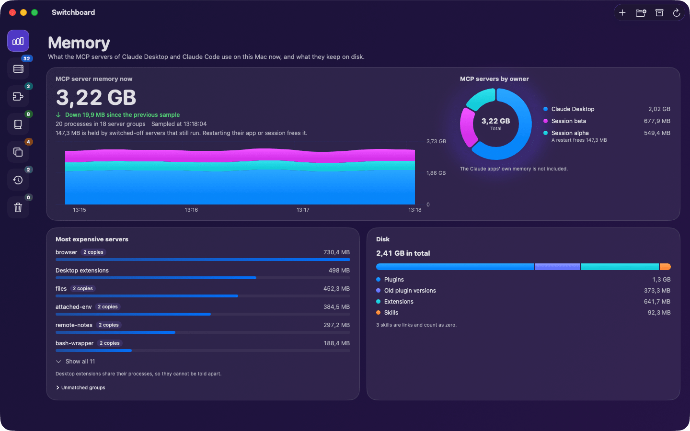
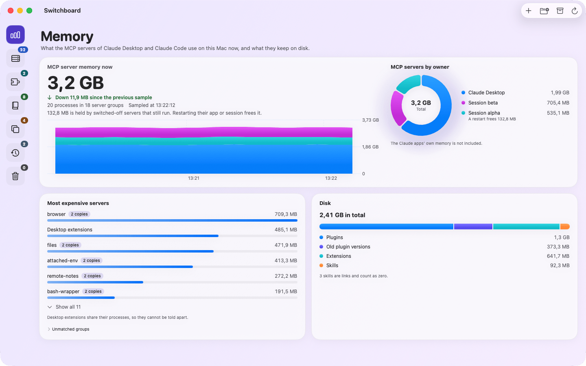
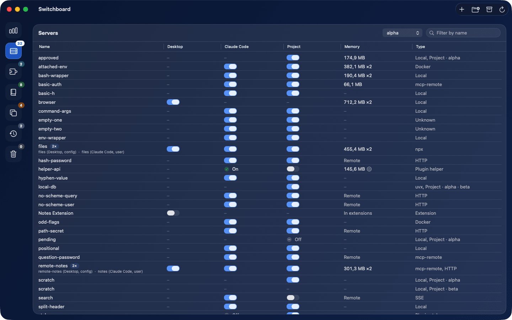
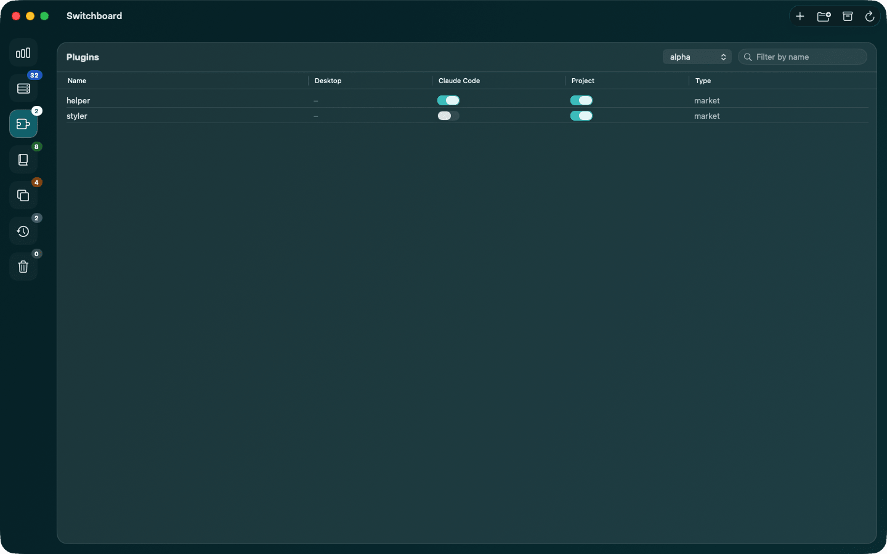
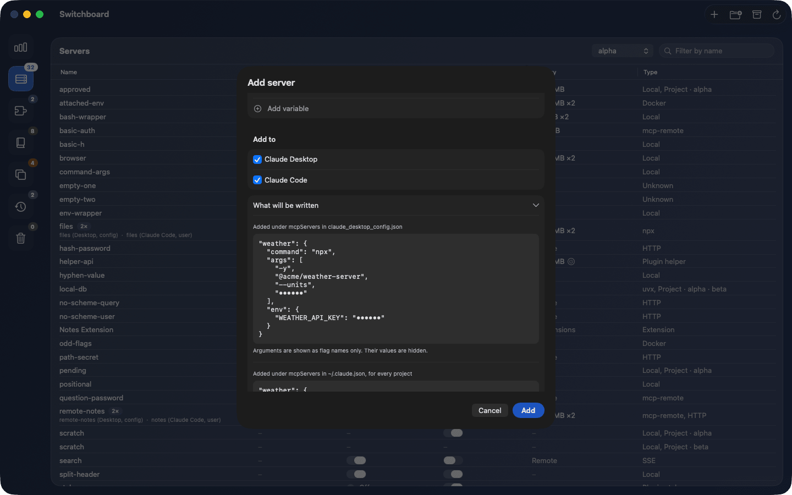

# Switchboard

Switchboard is a macOS app that shows everything Claude Desktop and Claude Code load on your Mac, in one window: MCP servers, plugins, and skills. It tells you what each server costs in memory, lets you switch things on and off per app or per project, and lets you add, copy, and remove servers without editing JSON by hand.

**Download:** get the latest build from the [releases page](https://github.com/voiceflow-gallagan/switchboard/releases). It needs macOS 14 or later. Unzip it and drag Switchboard to Applications.



It exists because the same server often ends up configured in both apps, each app keeps its settings in a different place, and a dozen servers running twice can take gigabytes of memory without anyone noticing.

## What it shows

- **Overview:** memory used by MCP servers right now, by app and by server, with a live chart of the last ten minutes, plus disk space used by plugins, extensions, and skills. The menu bar item shows the current total.
- **Servers, Plugins, Skills:** one row per item, with its state in Claude Desktop, in Claude Code, and in the project you pick. Duplicates across the two apps are merged and marked.
- **Removed:** servers taken out of a configuration, kept so they can be restored.
- **Settings:** light or dark appearance, whether the app shows a Dock icon, and updates: the installed version, a link to its notes, a Check Now button, and switches for checking and installing automatically. With the Dock icon hidden, the menu bar item is the only way in.

## What it can change

- Switch a server on or off for everything, or for one Claude Code project.
- Switch a plugin on or off, for everything or for one project.
- Add a project Claude Code has never opened, copying another project's switches.
- Add a new server to either app or both, or copy a server from one app to the other.
- Remove a server to the Removed list, restore it, or delete it for good.
- Uninstall and reinstall a plugin through Claude Code's own command.

Every change is written through the same path: a backup first, then an edit that touches only the bytes of the value that changes, then a read-back. Changes can be undone, and the app tells you which app or session must restart. Switchboard never restarts anything itself.

## Where it reads and writes

| App | Files |
|---|---|
| Claude Desktop | `~/Library/Application Support/Claude/claude_desktop_config.json`, the extension settings files |
| Claude Code | `~/.claude.json`, `~/.claude/settings.json`, the installed plugins, and each project's `.claude/settings.local.json` |
| Switchboard itself | `~/Library/Application Support/Switchboard/`: backups, kept servers, saved measurements |

Switchboard's own folder is readable only by your account. Backups and kept servers contain whatever the original files contain, including credentials. The app never shows a credential value and starts no program other than Claude Code's own `claude plugin` commands.

The only network use is the update check. On the second launch, the app asks whether it may check for new versions automatically. A check reads a small feed file from this repository on GitHub. As with any download, GitHub sees your IP address and the app's version. Nothing about your configuration is sent. Updates are downloaded from this repository's releases. The download's signature is checked against the key built into the app before it is unpacked, and the app's own code signature is checked again before it is installed. Debug builds never check.

## Building it

Requirements: macOS 14 or later to run, Xcode 27 with Swift 6.4 to build. Tested on macOS 26.

```bash
git clone https://github.com/voiceflow-gallagan/switchboard.git
cd switchboard

# The library and its tests
swift test --package-path SwitchboardCore

# The app
xcodebuild -project Switchboard.xcodeproj -scheme Switchboard -configuration Debug -derivedDataPath .build/xcode build
open .build/xcode/Build/Products/Debug/Switchboard.app
```

Or open `Switchboard.xcodeproj` in Xcode and press Run.

The project does not store a developer team. Copy `Config/Local.xcconfig.example` to `Config/Local.xcconfig` and put your team identifier in it. Git ignores that file. If you prefer, set the signing identity to "Sign to Run Locally". A locally signed build makes macOS ask for folder access again after every rebuild, because it sees each build as a new app.

Code style is checked with the formatter that ships with the Swift toolchain:

```bash
swift format format -i -r Switchboard SwitchboardCore/Sources SwitchboardCore/Tests Tools
swift format lint --strict --recursive Switchboard SwitchboardCore/Sources SwitchboardCore/Tests Tools
```

## Working on it safely

A debug build has a test mode. When the environment variable `SWITCHBOARD_HOME` names a folder inside the system temporary folder, the app treats that folder as the home folder for everything it reads and writes. The library tests ship a fixture home with invented data under `SwitchboardCore/Tests/SwitchboardCoreTests/Fixtures/home`. Copy it somewhere under `$TMPDIR`, point the variable at the copy, and you can try every switch without touching your real configuration. Set `SWITCHBOARD_DEMO` as well to replace this Mac's memory and disk figures with invented ones, as in the screenshots. Release builds ignore both variables.

## How the repository is laid out

| Path | Content |
|---|---|
| `SwitchboardCore/` | The library: reading both apps' configuration, matching running processes to servers, and every write path. All logic lives here and is tested |
| `Switchboard/` | The SwiftUI app: views, stores, theme |
| `Tools/make-icon.swift` | Draws the app icon at every size macOS needs |
| `Tools/release.sh`, `Tools/appcast-item.sh` | Build, sign, notarize, and publish a release, and add it to the update feed |
| `appcast.xml` | The update feed the app reads, newest release first |
| `.claude/prds/` | The product requirements document: the problem, the users, the milestones |
| `.claude/plans/` | One plan per milestone, with the decisions taken, the review findings, and the known limits |

The documents under `.claude/` are the design record of the project. They hold no credentials and are safe to keep in the repository. Local Claude Code settings for this folder are ignored by git.

## Screenshots

These show the fixture home with invented memory and disk figures, not data from a real Mac.









## How releases are made

Development happens in a private repository. It also holds the design documents. The `main` branch of this repository receives published snapshots, made by a script that lives in the private repository. A release is cut with `Tools/release.sh <version> --notes <file>`, where the file holds the What's new section of the release notes. It builds, signs with a Developer ID, notarizes, staples, attaches the zip to a GitHub release here, and adds a signed entry to `appcast.xml`. Publish first, then release, then publish again so the feed carries the new entry.

The feed is signed with a Sparkle key that lives in the login keychain of the Mac that cuts releases, with its public half in `Switchboard/Info.plist`. The script refuses to run when the key is missing or does not match. If the private key were lost, installed copies could never update again; keep a backup of it outside that Mac.

## Known limits

- A very small window remains in which a write by a running Claude Code session to the same file could be overwritten. The earlier state is in the backup.
- A server switched off or removed is kept in Switchboard's folder with its credentials until it is deleted for good.
- Claude Desktop runs each configured server twice. Switchboard reports it; it cannot change it.
- Only a Claude Code installed in its standard folder, `~/.local/share/claude/versions/`, can be used for plugin commands.
- Cloud connectors from claude.ai are listed by name only, from the history Claude Code keeps, and cannot be changed.

## Licence

Switchboard is released under the MIT licence. See `LICENSE`.
